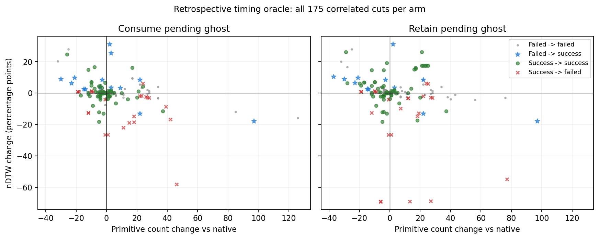

# Collision interruption timing oracle

2026-10-08. **CONDITIONAL GO for an independent causal confirmation only.** There
is a recoverable mid-option interruption opportunity in this training cohort.
Neither an effective deployable trigger nor execution-failure dominance has been
established. The adaptive-density selector and frozen graph-preference recipe
remain NO-GO; no model, RL or VLM is added.

## Frozen experiment and controls

Protocol and exact schedule were committed in `30bc545` before rollout. We tested
all 175 known eligible ghost-segment collision cuts from the old fresh64 training
cohort: 87 cuts on 7 native-failed routes and 88 on 12 native-successful routes.
The cohort has ten baseline failures overall; three have no eligible cut. Two
successful nonempty-back-path options have unknown phase and are outside scope.
This is previously inspected training data, not untouched validation.

At each cut, the original navigator continues after either: matched sensing then
completion of the pending action; interruption with native ghost consumption;
or interruption while retaining the pending ghost. Nineteen native route controls
plus 175*3 arms give **544 full rollouts**, following 25 smoke rollouts. The full
run took 633.18 seconds after driver initialization. This is experimental replay
runtime, not deployable inference latency.

The original release R2R checkpoint, seed100, sensors, sliding=true, effective
tryout=false, graph controller, native STOP and 15-decision budget remain fixed.
Each case replays the exact native prefix, intervenes once, and runs the original
navigator to termination. Actual physics/collision/primitive cost is never rewound.
The sensing-only arm sees the same cut panorama; renders and policy calls are
logged separately. This matches cut sensing, not total episode compute: later
paths and decision counts can differ. No prospective replication outcomes or
validation data were used to design or evaluate this study.

## Timing opportunity on failed routes

"Quality rescue" means final success with nDTW no worse than native (1e-6
tolerance). It does not mean every metric improves. Each column holds ghost
semantics fixed; choosing the best cut is privileged retrospective analysis.

| Failed-route outcome | Consume pending ghost | Retain pending ghost |
| --- | ---: | ---: |
| Any tested cut rescues SR | 5/7 | 4/7 |
| Any cut rescues SR without nDTW loss | **4/7, 3 scenes** | **3/7, 2 scenes** |
| Also no extra primitives | 3/7 | 2/7 |
| First eligible cut rescues SR | 4/7 | 3/7 |
| First eligible cut rescues SR without nDTW loss | 3/7 | 2/7 |
| First eligible cut also adds no primitives | 2/7 | 2/7 |

Consume quality-rescue routes are **4702, 5247, 5648, 7362**; retain rescues the
last three. Route5648 adds a scene and requires a later option: its first eligible
event does not rescue success. Timing therefore matters within this tested set,
although much of the newly observed opportunity comes from three routes omitted
by the earlier four-route cap. This does not establish that all gains require
precise primitive-level timing. No universally optimal policy tree is searched.

Representative consume cases below maximize nDTW among quality-rescuing cuts on
each route, then prefer fewer primitives and earlier cuts. This is an explicitly
post hoc illustration, not the cost-capped subset or a learned selection rule.

| Route | Step / primitive cut | ΔnDTW (pp) | Δprimitives | Δpath (m) |
| --- | --- | ---: | ---: | ---: |
| 4702 | 8 / 3 | +4.019 | -4 | +0.157 |
| 5247 | 0 / 6 | +3.551 | +3 | -2.694 |
| 5648 | 4 / 7 | +31.126 | +2 | +6.857 |
| 7362 | 1 / 7 | +9.881 | -21 | -2.573 |

Other cuts on 5247 meet the primitive cap. The example on 5648 increases path and
cost despite rescuing success/quality. Four quality-rescued routes are **4/10 of
all fresh64 native failures**, not a majority. Replanning also changes high-level
selection and topology exposure; this is not a pure low-level execution diagnosis.

## Successful-route controls: interruption is not automatically safe

| Successful-route outcome | Consume | Retain |
| --- | ---: | ---: |
| Any tested cut causes SR loss | 2/12 | 2/12 |
| Any tested cut reduces nDTW | 11/12 | 11/12 |
| First eligible cut causes SR loss | **0/12** | **1/12** |
| First eligible cut reduces nDTW | **8/12** | **7/12** |
| First eligible cut mean ΔnDTW (pp) | -2.617 | -6.831 |
| First eligible cut mean Δprimitives | +2.167 | +5.333 |

The any-cut success losses occur on routes5822 and8928; retaining the pending
ghost already loses route5822 at its earliest event. Any-cut harm is a stress-test
exposure, not the harm rate of an unimplemented trigger. The first-event controls
are actual single-cut returns on this selected symptom-exposed cohort, not full64
or benchmark results. Successful-route nDTW losses cannot be hidden behind an
unchanged binary SR. Native continuation/abstention remains a valid control.

On failed routes, the first-cut mean primitive changes are +24.857 (consume) and
+4.857 (retain), despite SR rescues. Thus even the fixed first-collision rule
does not establish cost-efficient navigation. These data do not justify replacing
the NO-GO scorer with an unconditional collision interrupt.

## Verification

All 19 native controls and 175 sensing-only continuations reproduce native
outcomes. A separately written verifier checks **4,590 native/sensing/prefix
option records, 350 interrupted physical prefixes, 350 equal cut panoramas,
4,352 reconstructed return components and 7,118 physical path continuities**.
All pass. Retain/consume graph flags are checked on 175 cases each. Goal geodesic
distance is the recorded simulator measurement, not a second navmesh computation.
The reconstruction uses the prescribed fastdtw metric and released train reference.

Five legacy eligibility tests, four return-classification tests, the separate
25-rollout smoke verification, and full-run verification pass. No simulator run
failed or was discarded. Coverage attempt001's earlier STOP-phase assertion error
is retained separately in the preceding coverage audit, not mixed into these runs.

## Decision and next question

Both fixed ghost-semantics arms meet the registered two-route/two-scene opportunity
gate. **Only an independently specified confirmation is warranted.** This result
changes the interrupt opportunity assessment, not the failed ranking recipe.

The next most informative comparison is event timing versus outcome-blind cuts
within the same native option, on independent training routes with successful
controls. It must distinguish collision-specific timing from merely adding a
replanning boundary. Keep native continuation, matched sensing, original budget,
fixed ghost semantics, costs and abstention explicit. Freeze route sampling and
cut selection before intervention returns; do not tune a trigger on these 175
cuts or claim novelty before completing related-method/code checks.

No interruption policy, PPO/VLM component or waypoint predictor change has been
implemented. Backtracking interruptions, repeated interruptions, semantic events,
other controller settings and multiple simulator seeds remain untested.

Artifacts: `results/interrupt_timing_oracle_001/` contains the protocol-linked
plan, complete outcomes, per-route/per-cut metrics, verifier evidence, logs,
source manifests, compressed raw case traces and an archive manifest.

Each panel contains 175 correlated cut returns. Points are not independent routes.
